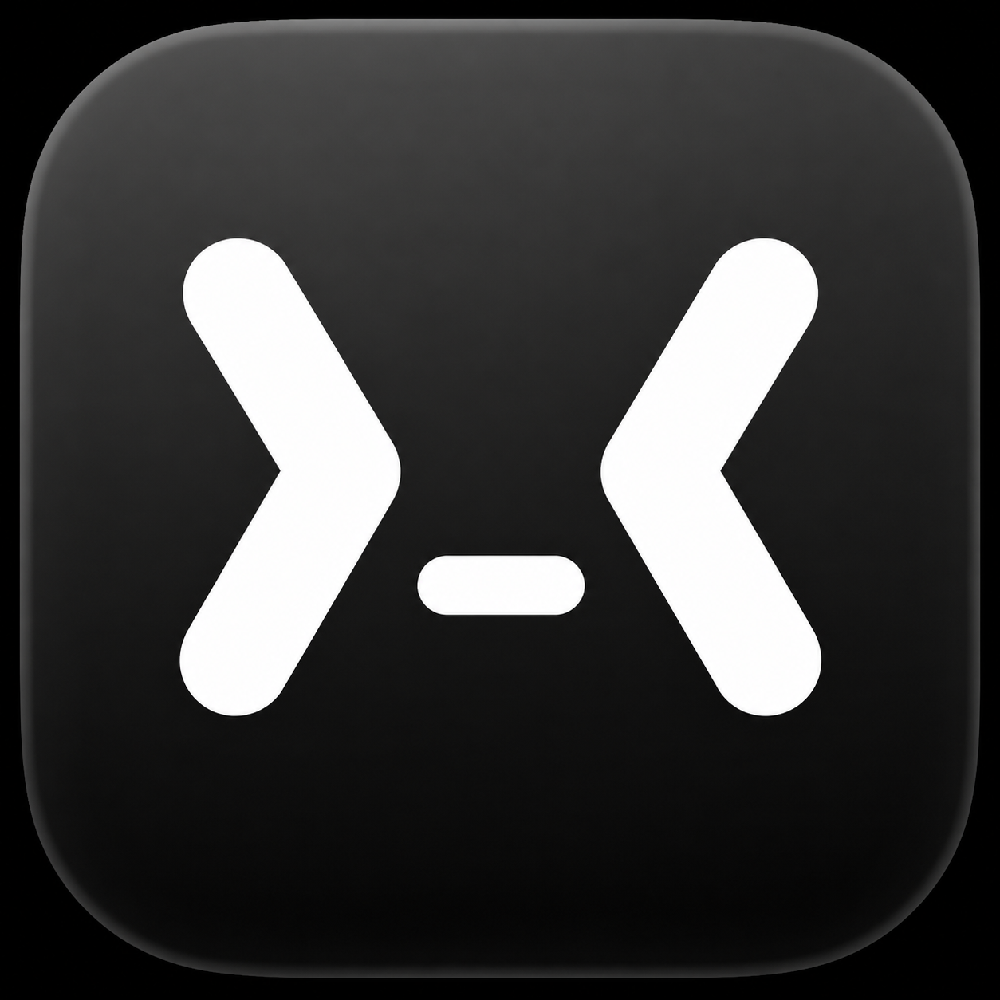
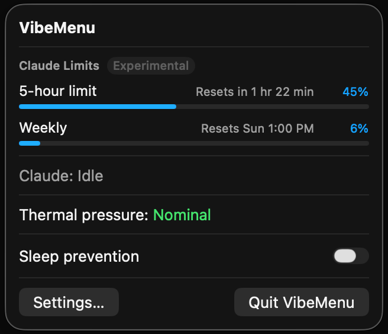

<p align="center"></p>

<h1 align="center">VibeMenu</h1>

<p align="center"><strong>Native macOS menu-bar radar for Claude coding sessions, usage limits, thermal pressure, and sleep prevention.</strong></p>

<p align="center">
  
  
  
  
  
</p>

<p align="center"></p>

---

## Download

<p align="center">
  <a href="https://github.com/Kirill-Chistov/VibeMenu-Public/releases/download/v0.2/VibeMenu-v0.2-macOS-universal.zip"><strong>⬇️&nbsp; Download VibeMenu v0.2 &nbsp;·&nbsp; macOS universal (.zip)</strong></a>
</p>

<p align="center">
  <a href="https://github.com/Kirill-Chistov/VibeMenu-Public/releases/download/v0.2/VibeMenu-v0.2-macOS-universal.zip.sha256">SHA-256 checksum</a>
  &nbsp;·&nbsp;
  <a href="https://github.com/Kirill-Chistov/VibeMenu-Public/releases/latest">All releases</a>
</p>

Universal Mac build — runs natively on Apple Silicon and Intel. Requires **macOS 15 (Sequoia) or later**.

> **Heads up:** VibeMenu v0.2 is **not signed with an Apple Developer ID and is not notarized**, so macOS Gatekeeper warns on first launch. See [Install](#install) for the one-time approval step.

Verify your download (optional):

```sh
shasum -a 256 -c VibeMenu-v0.2-macOS-universal.zip.sha256
```

## What it does

VibeMenu lives in your menu bar and gives you an at-a-glance **radar** of your Claude coding activity:

- **Which sessions are running** — a live view of your Claude coding sessions.
- **How close you are to your limits** — 5-hour, weekly, and model-specific usage, before you hit a wall.
- **How hard your Mac is working** — a heads-up when thermal pressure climbs.
- **Whether it will stay awake** — keep your Mac from sleeping while Claude is busy.

No Dock icon, no window — just a tidy menu in the top-right of your screen.

## Why use it

If you run **Claude Code or other coding agents on macOS**, long sessions tend to raise the same questions: *Am I about to hit a usage limit? Is a session still going? Is my Mac overheating or about to sleep mid-run?*

VibeMenu answers all of that from the menu bar, so you can keep working instead of checking. It's local, quiet, and built for people who leave Claude running.

## Features

- **Claude Session Radar** — see your active Claude coding sessions at a glance.
- **Claude Usage Limits Preview** — know where you stand before you run out.
  - 5-hour, weekly, and model-specific limit rows.
  - **Per-limit visibility** — show or hide individual rows to keep the menu tidy.
- **Thermal pressure** — a heads-up when your Mac is running hot.
- **Sleep prevention** — keep your Mac awake while Claude is working.
- **Cleaner, collapsible settings** — simplified and easier to scan.

## Privacy

VibeMenu is **local-only**. Everything it shows is derived from local files on your Mac and displayed on your own machine.

- **No telemetry** — nothing about your usage is collected or reported.
- **No network calls** — the app never contacts a server or API.
- **No backend** — there is no VibeMenu cloud service.
- **No API keys, no cookies** — nothing to sign in to, nothing stored off-device.

It reads only the local Claude-related files it needs to show session titles and, if you enable it, usage-limit info. The **source code remains private and proprietary**. See [PRIVACY.md](PRIVACY.md) for the full model.

## Install

1. **Download** [`VibeMenu-v0.2-macOS-universal.zip`](https://github.com/Kirill-Chistov/VibeMenu-Public/releases/download/v0.2/VibeMenu-v0.2-macOS-universal.zip).
2. **Unzip** it (double-click in Finder) — you'll get **VibeMenu.app**.
3. **Move** `VibeMenu.app` into your `/Applications` folder.
4. **First launch** — because the app is unsigned and not notarized, macOS blocks the first open. To approve it:
   - **Right-click** (or Control-click) `VibeMenu.app` → **Open**, then click **Open** again in the dialog, **or**
   - open **System Settings → Privacy & Security**, scroll to the **Security** section, and click **Open Anyway**.
   - You only need to do this once. After that VibeMenu opens normally.

VibeMenu runs as a **menu-bar icon** — there is no Dock icon or app window.

## Limitations

- **Unsigned / not notarized.** Gatekeeper warns on first open (see [Install](#install)).
- **Claude Usage Limits is experimental.** It's off by default and may not always match the numbers you see in Claude.
- **Claude Desktop cache reading may break.** Usage-limit reading relies on Claude Desktop's local cache; if Claude changes its internals, this can stop working until VibeMenu is updated.

## Support

Found a bug or have a request? Please open an issue on the
**[VibeMenu-Public issue tracker](https://github.com/Kirill-Chistov/VibeMenu-Public/issues)**. Include your macOS version and a clear description of what you saw versus what you expected.

Please don't include private data (real transcript contents, tokens, etc.) in reports.

## License

VibeMenu is **proprietary software**, distributed here as a **binary-only** download. The app binary is provided under the license in [LICENSE.md](LICENSE.md); no source-code rights are granted, and the source code is not included in this repository.

---

© 2026 Dmitrii / Kirill Chistov. All rights reserved. VibeMenu is not affiliated with or endorsed by Anthropic. "Claude" is a trademark of Anthropic, PBC.
